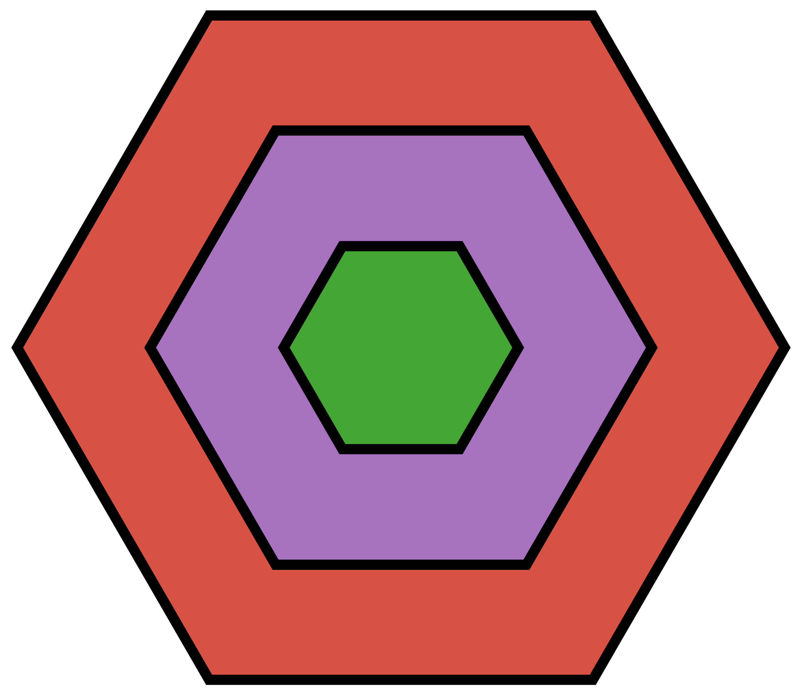
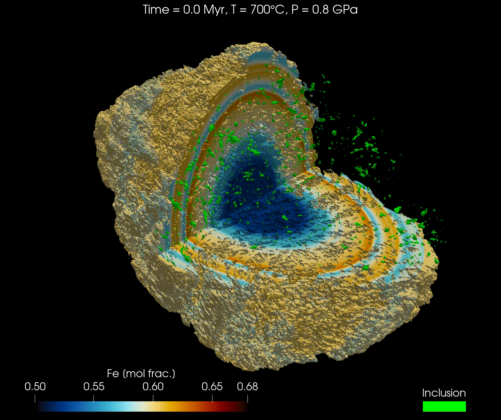

<h1>  DiffusionGarnet.jl </h1>

[](https://github.com/Iddingsite/DiffusionGarnet.jl/actions/workflows/CI.yml)
[![][docs-dev-img]][docs-dev-url]
[](https://zenodo.org/badge/latestdoi/680108566)

[docs-dev-img]: https://img.shields.io/badge/docs-dev-blue.svg
[docs-dev-url]: https://iddingsite.github.io/DiffusionGarnet.jl/dev/

DiffusionGarnet is a Julia package that can be used to do coupled diffusion modelling of major elements on natural garnet data. It currently supports 1D, 2D, 3D, and spherical coordinates and was developed with performance in mind.

It is built on top of the [DifferentialEquations.jl](https://github.com/SciML/DifferentialEquations.jl) package ecosystem and uses [Unitful.jl](https://github.com/PainterQubits/Unitful.jl) to allow the user to define appropriate units for their problems. For 2D and 3D models, it uses [ParallelStencil.jl](https://github.com/omlins/ParallelStencil.jl) to support multithreading on CPU and parallel computing on GPU.

To know more about this package, don't hesitate to refer to the [documentation](https://iddingsite.github.io/DiffusionGarnet.jl/dev/).

Below we give a number of examples to get you started with DiffusionGarnet.jl.

### 1D simulations

A simple 1D example from a real chemical garnet profile for constant pressure and temperature conditions is shown bellow. The diffusion coefficients used by default are those of [Chakraborty & Ganguly (1992)](https://doi.org/10.1007/BF00296579) but other datasets are also available, see the documentation.

```julia
using DiffusionGarnet
using DelimitedFiles
using Plots
using Printf

# load the data of your choice (here from the text file located in https://github.com/Iddingsite/DiffusionGarnet.jl/tree/main/examples/1D, place it in the same folder as where you are running the code)
data = DelimitedFiles.readdlm("Data_Grt_1D.txt", '\t', '\n', header=true)[1]

CMg0 = data[:, 4]
CFe0 = data[:, 2]
CMn0 = data[:, 3]
CCa0 = data[:, 5]

Lx = 8700u"µm"
tfinal = 15u"Myr"

# define the initial conditions in 1D of your problem
IC1D = IC1DMajor(;CMg0, CFe0, CMn0, Lx, tfinal)

# define the PT conditions
T = 900u"°C"
P = 0.6u"GPa"

# define a Domain struct containing the definition of your problem
domain1D = Domain(IC1D, T, P)

# solve the problem using DifferentialEquations.jl
sol = simulate(domain1D);

# you can now plot the solutions from the sol variable
anim = @animate for i = LinRange(0, sol.t[end], 100)
    l = @layout [a ; b]

    p1 = plot(distance, CFe0, label="Fe initial", linestyle = :dash, linewidth=1, dpi=200, title = @sprintf("Total Time = %.2f Myr | T = %.0f °C | P = %.1f GPa", i, T[1].val, P[1].val), legend=:outerbottomright, linecolor=1,xlabel = "Distance (µm)")
    p1 = plot!(distance, sol(i)[:,2], label="Fe",linecolor=1, linewidth=1)


    p2 = plot(distance, CMg0, label="Mg initial", linestyle = :dash, linewidth=1, dpi=200,legend=:outerbottomright,linecolor=2,xlabel = "Distance (µm)")
    p2 = plot!(distance, CMn0, label="Mn initial", linestyle = :dash, linewidth=1, linecolor=3)
    p2 = plot!(distance, CCa0, label="Ca initial", linestyle = :dash, linewidth=1, linecolor=4)
    p2 = plot!(distance, sol(i)[:,1], label="Mg",linecolor=2, linewidth=1)

    p2 = plot!(distance, sol(i)[:,3], label="Mn", linecolor=3, linewidth=1)

    p2 = plot!(distance, 1 .- sol(i)[:,1] .- sol(i)[:,2] .- sol(i)[:,3], label="Ca", linecolor=4, linewidth=1)

    plot(p1, p2, layout = l)
end every 1

println("Now, generating the gif...")
gif(anim, "Grt_1D.gif", fps = 7)
println("...Done!")
```

Here is the gif obtained:


### 3D simulations

Bellow is an example of a 3D simulation of garnet diffusion using the same data as in the publication "Simulating major element diffusion in garnet using realistic 3D geometries" by [Dominguez et al. (2025)](https://doi.org/10.1016/j.cageo.2025.106023). The results are saved in a HDF5 file that can be visualised with [ParaView](https://www.paraview.org/). The equivalent simulation running on GPU is shown in the [documentation](https://iddingsite.github.io/DiffusionGarnet.jl/dev/diffusion_3D_GPU/).

```julia
using Downloads
using JLD2
using DiffusionGarnet

# define the current directory as the working directory
cd(@__DIR__)

# Define the Zenodo dataset URL, you can change the name to download other datasets in the Zenodo repository (https://zenodo.org/records/15045718)
# here, we will download the lowest resolution dataset (256³) to save time, for the model isolated matrix model (IMM). See publication for more details.
data_file = "256_cubed_IMM_compo.jld2"

# check if the file is already downloaded
if !isfile(data_file)
    # Define the Zenodo dataset URL, you can change the name to download other datasets in the Zenodo repository.
    zenodo_url = "https://zenodo.org/records/15045718/files/" * data_file * "?download=1"

    # Download the file in the same folder as this file (this can take a while if you connection is slow)
    Downloads.download(zenodo_url, data_file)
end

# use JLD2
file = jldopen(data_file, "r")
@unpack Mg0, Fe0, Mn0, Ca0, grt_boundary = file
close(file)

# define total length in x and y
Lx = 11422.61u"µm"
Ly = 11422.61u"µm"
Lz = 7623.57u"µm"
# define total time for the model
tfinal = 10.0u"Myr"
# define the pressure and temperature conditions
T = 700u"°C"
P = 0.8u"GPa"

# composition at the contact between garnet and matrix
Mg_border = 0.1152
Fe_border = 0.6012
Mn_border = 0.0435
Ca_border = 0.2401

# add this to fix the composition on the boundary
Mg0[grt_boundary .== 1] .= Mg_border
Fe0[grt_boundary .== 1] .= Fe_border
Mn0[grt_boundary .== 1] .= Mn_border
Ca0[grt_boundary .== 1] .= Ca_border

# convert to float32
Mg0 = convert(Array{Float32}, Mg0)
Fe0 = convert(Array{Float32}, Fe0)
Mn0 = convert(Array{Float32}, Mn0)
Ca0 = convert(Array{Float32}, Ca0)
grt_boundary = convert(Array{Float32}, grt_boundary)

IC3D = IC3DMajor(;CMg0=Mg0, CFe0=Fe0, CMn0=Mn0, Lx, Ly, Lz, tfinal, grt_boundary)
domain3D = Domain(IC3D, T, P)

time_save_first = collect(range(0, 1, step=0.1))u"Myr"
time_save_second = collect(range(1.5, 10, step=0.5))u"Myr"
time_save = vcat(time_save_first,time_save_second)

@unpack t_charact = domain3D  # unpack characteristic time to nondimensionalise the time for the simulation
time_save_ad = ustrip.(u"Myr", time_save) ./ t_charact  # convert to Myr, remove units, and convert to nondimensional time

# create the callback function
save_data_callback = PresetTimeCallback(time_save_ad, save_data_paraview, save_positions=(false,false))

path_save = "data_model_10_Ma_CPU.h5"  # choose the name and the path of the HDF5 output file (make sure to add .h5 or .hdf5 at the end)

# run the simulation with ROCK2 solver
sol = simulate(domain3D; callback=save_data_callback, path_save=path_save, save_everystep=false,  save_start=false, progress=true, progress_steps=1, solver=ROCK2());
```

Here are the results for the Fe diffusion for instance, visualised with ParaView:



## Installation

DiffusionGarnet may be installed directly from the REPL:
```julia-repl
julia>]
  pkg> add DiffusionGarnet
```

And you can test the package with:

```julia-repl
julia>]
  pkg> test DiffusionGarnet
```

## Funding & author

The development of this package was supported by the European Research Council (ERC) under the European Union's Horizon 2020 research and innovation programme (grant agreement No 850530).

Author: Hugo Dominguez (hdomingu@univ-mainz.de).
