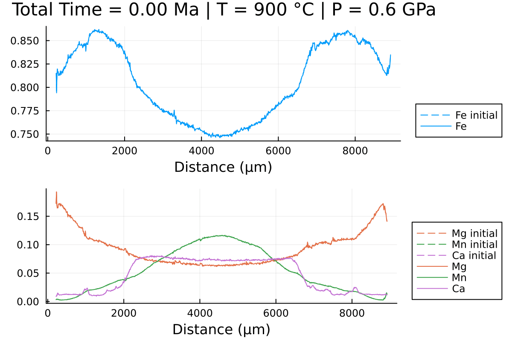

<h1>  DiffusionGarnet.jl </h1>

[](https://github.com/Iddingsite/DiffusionGarnet.jl/actions/workflows/CI.yml)
[![][docs-dev-img]][docs-dev-url]
[](https://zenodo.org/badge/latestdoi/680108566)

[docs-dev-img]: https://img.shields.io/badge/docs-dev-blue.svg
[docs-dev-url]: https://iddingsite.github.io/DiffusionGarnet.jl/dev/

DiffusionGarnet is a Julia package that can be used to do coupled diffusion modelling of major elements on natural garnet data. It currently supports 1D, 2D, 3D, and spherical coordinates.

It is built on top of the [DifferentialEquations.jl](https://github.com/SciML/DifferentialEquations.jl) package ecosystem and uses [Unitful.jl](https://github.com/PainterQubits/Unitful.jl) to allow the user to define appropriate units for their problems. For 2D and 3D models, it uses [ParallelStencil.jl](https://github.com/omlins/ParallelStencil.jl) to support multithreading on CPU and parallel computing on GPU.

To know more about this package, don't hesitate to refer to the [documentation](https://iddingsite.github.io/DiffusionGarnet.jl/dev/).

### Quick start

```julia
using DiffusionGarnet
using DelimitedFiles
using Plots
using Printf

# load the data of your choice (here from the text file located in https://github.com/Iddingsite/DiffusionGarnet.jl/tree/main/examples/1D, place it in the same folder as where you are running the code)
data = DelimitedFiles.readdlm("Data_Grt_1D.txt", '\t', '\n', header=true)[1]

Mg0 = data[:, 4]
Fe0 = data[:, 2]
Mn0 = data[:, 3]
Ca0 = data[:, 5]
distance = data[:, 1]
Lx = (data[end,1] - data[1,1])u"µm"
tfinal = 15u"Myr"

# define the initial conditions in 1D of your problem
IC1D = IC1DMajor(;CMg0, CFe0, CMn0, Lx, tfinal)

# define the PT conditions
T = 900u"°C"
P = 0.6u"GPa"

# define a Domain struct containing the definition of your problem
domain1D = Domain(IC1D, T, P)

# solve the problem using DifferentialEquations.jl
sol = simulate(domain1D);

# you can now plot the solutions from the sol variable

@unpack t_charact = domain1D

anim = @animate for i = LinRange(0, sol.t[end], 100)
    l = @layout [a ; b]

    p1 = plot(distance, Fe0, label="Fe initial", linestyle = :dash, linewidth=1, dpi=200, title = @sprintf("Total Time = %.2f Ma | T = %.0f °C | P = %.1f GPa", i*t_charact, T[1].val, P[1].val), legend=:outerbottomright, linecolor=1,xlabel = "Distance (µm)")
    p1 = plot!(distance, sol(i)[:,2], label="Fe",linecolor=1, linewidth=1)


    p2 = plot(distance, Mg0, label="Mg initial", linestyle = :dash, linewidth=1, dpi=200,legend=:outerbottomright,linecolor=2,xlabel = "Distance (µm)")
    p2 = plot!(distance, Mn0, label="Mn initial", linestyle = :dash, linewidth=1, linecolor=3)
    p2 = plot!(distance, Ca0, label="Ca initial", linestyle = :dash, linewidth=1, linecolor=4)
    p2 = plot!(distance, sol(i)[:,1], label="Mg",linecolor=2, linewidth=1)

    p2 = plot!(distance, sol(i)[:,3], label="Mn", linecolor=3, linewidth=1)

    p2 = plot!(distance, 1 .- sol(i)[:,1] .- sol(i)[:,2] .- sol(i)[:,3], label="Ca", linecolor=4, linewidth=1)

    plot(p1, p2, layout = l)
end every 1

println("Now, generating the gif...")
gif(anim, "Grt_1D.gif", fps = 7)
println("...Done!")
```

Here is the gif obtained:




## Installation

DiffusionGarnet may be installed directly from the REPL:
```julia-repl
julia>]
  pkg> add DiffusionGarnet
```

And you can test the package with:

```julia-repl
julia>]
  pkg> test DiffusionGarnet
```

## Funding & author

The development of this package was supported by the European Research Council (ERC) under the European Union's Horizon 2020 research and innovation programme (grant agreement No 850530).

Author: Hugo Dominguez (hdomingu@univ-mainz.de).
