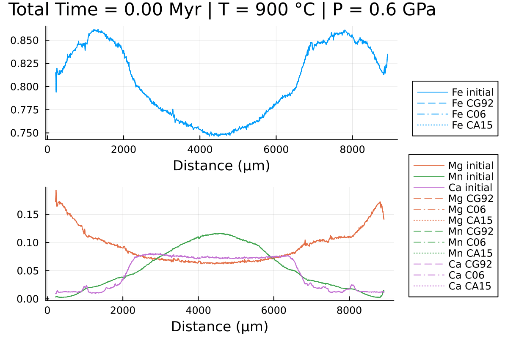

# [Using different diffusion coefficient datasets](@id Coeff_Diff)

By default, DiffusionGarnet.jl uses the diffusion coefficients of [Chakraborty & Ganguly (1992)](https://doi.org/10.1007/BF00296579) to model garnet diffusion. However, it is possible to use other datasets: the one from [Carlson (2006)](https://doi.org/10.2138/am.2006.2043) and the one from [Chu and Ague 2015](https://doi.org/10.1007/s00410-015-1175-y). This tutorial will show how to use these different datasets in DiffusionGarnet.jl and we will compare them with a simple simulation.

We will use the same data as in the [1D diffusion tutorial](@ref 1D_diffusion) for this example. First, we will load the data, which should be in the same folder as your current session:

```julia
using DiffusionGarnet  # this can take a while
using DelimitedFiles
# load the data of your choice (here from the text file located in https://github.com/Iddingsite/DiffusionGarnet.jl/tree/main/examples/1D, place it in the same folder as where you are running the code)
data = DelimitedFiles.readdlm("Data_Grt_1D.txt", '\t', '\n', header=true)[1]

Mg0 = data[:, 4]  # load initial Mg mole fraction
Fe0 = data[:, 2]  # load initial Fe mole fraction
Mn0 = data[:, 3]  # load initial Mn mole fraction
Ca0 = data[:, 5]  # load initial Ca mole fraction
distance = data[:, 1]

Lx = (data[end,1] - data[1,1])u"µm"  # length in x of the model, here in µm
tfinal = 15u"Myr"  # total time of the model, here in Myr

# define the initial conditions in 1D of your problem
IC1D = IC1DMajor(;CMg0, CFe0, CMn0, Lx, tfinal)

# define the pressure and temperature conditions of diffusion
T = 700u"°C"
P = 0.6u"GPa"
```

To choose the diffusion coefficient dataset, it only requires a keyword argument in the `Domain` constructor: `diffcoef`.

It can take the following values:

- `:C92` for the dataset of Chakraborty and Ganguly (1992), which is the default value.
- `:C06` for the dataset of Carlson (2006)
- `:CA15` for the dataset of Chu and Ague (2015)

Let's define three domains with these different datasets:

```julia
domain1D_C92 = Domain(IC1D, T, P, diffcoef = :C92)
domain1D_C06 = Domain(IC1D, T, P, diffcoef = :C06)
domain1D_CA15 = Domain(IC1D, T, P, diffcoef = :CA15)
```

!!! note
    This is exactly the same syntax to change the dataset of diffusion coefficients for spherical, 2D Cartesian, and 3D Cartesian coordinates.


We can now simulate the three domains:

```julia
sol_C92 = simulate(domain1D_C92; progress=true, progress_steps=1)
sol_C06 = simulate(domain1D_C06; progress=true, progress_steps=1)
sol_CA15 = simulate(domain1D_CA15; progress=true, progress_steps=1)
```

Done! We can now plot the results of our simulations to compare the different diffusion coefficient datasets:

```julia
# Choose consistent base colors for each element
col_Fe = 1
col_Mg = 2
col_Mn = 3
col_Ca = 4

anim = @animate for i in LinRange(0, sol_CG92.t[end], 100)
    l = @layout [a ; b]

    # ----------- Panel 1: Fe -----------
    p1 = plot(distance, CFe0, label="Fe initial",
              linestyle=:dash, linewidth=1, dpi=200,
              title=@sprintf("Total Time = %.2f Myr | T = %.0f °C | P = %.1f GPa",
                             i, T[1].val, P[1].val),
              legend=:outerbottomright, linecolor=col_Fe,
              xlabel="Distance (µm)")

    # Fe - CG92
    plot!(p1, distance, sol_CG92(i)[:,2], label="Fe CG92",
          color=col_Fe, linewidth=1, linestyle=:solid)
    # Fe - C06
    plot!(p1, distance, sol_C06(i)[:,2],
          label="Fe C06", color=col_Fe, linewidth=1, linestyle=:dashdot)
    # Fe - CA15
    plot!(p1, distance, sol_CA15(i)[:,2],
          label="Fe CA15", color=col_Fe, linewidth=1, linestyle=:dot)


    # ----------- Panel 2: Mg, Mn, Ca -----------
    p2 = plot(distance, CMg0, label="Mg initial",
              linestyle=:dash, linewidth=1, dpi=200,
              legend=:outerbottomright, color=col_Mg, xlabel="Distance (µm)")

    plot!(p2, distance, CMn0, label="Mn initial",
          linestyle=:dash, linewidth=1, color=col_Mn)
    plot!(p2, distance, CCa0, label="Ca initial",
          linestyle=:dash, linewidth=1, color=col_Ca)

    # Mg
    plot!(p2, distance, sol_CG92(i)[:,1], label="Mg CG92",
          color=col_Mg, linewidth=1, linestyle=:solid)
    plot!(p2, distance, sol_C06(i)[:,1],
          label="Mg C06", color=col_Mg, linewidth=1, linestyle=:dashdot)
    plot!(p2, distance, sol_CA15(i)[:,1],
          label="Mg CA15", color=col_Mg, linewidth=1, linestyle=:dot)

    # Mn
    plot!(p2, distance, sol_CG92(i)[:,3], label="Mn CG92",
          color=col_Mn, linewidth=1, linestyle=:solid)
    plot!(p2, distance, sol_C06(i)[:,3],
          label="Mn C06", color=col_Mn, linewidth=1, linestyle=:dashdot)
    plot!(p2, distance, sol_CA15(i)[:,3],
          label="Mn CA15", color=col_Mn, linewidth=1, linestyle=:dot)

    # Ca (closure relation)
    plot!(p2, distance, 1 .- sol_CG92(i)[:,1] .- sol_CG92(i)[:,2] .- sol_CG92(i)[:,3],
          label="Ca CG92", color=col_Ca, linewidth=1, linestyle=:solid)
    plot!(p2, distance, 1 .- sol_C06(i)[:,1]
                       .- sol_C06(i)[:,2]
                       .- sol_C06(i)[:,3],
          label="Ca C06", color=col_Ca, linewidth=1, linestyle=:dashdot)
    plot!(p2, distance, 1 .- sol_CA15(i)[:,1]
                       .- sol_CA15(i)[:,2]
                       .- sol_CA15(i)[:,3],
          label="Ca CA15", color=col_Ca, linewidth=1, linestyle=:dot)

    plot(p1, p2, layout=l)
end every 1

println("Now, generating the gif...")
gif(anim, "Grt_1D_compare.gif", fps = 7)
println("...Done!")
```

Here is the resulting gif obtained:



Notice the differences, especially in Mn and Fe.