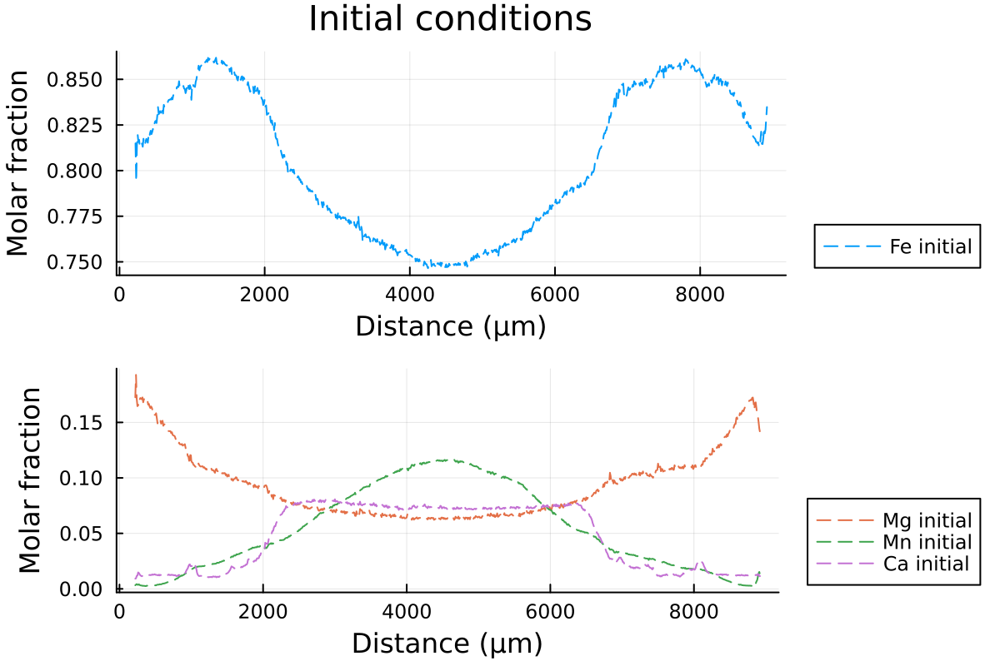

# [Diffusion in 1D Cartesian coordinates](@id 1D_diffusion)

DiffusionGarnet expects the user to provide real natural data for modelling major element diffusion in garnet. Note that the profiles must be evenly spaced. A set of example data can be found in the repository of the package in the [1D examples section](https://github.com/Iddingsite/DiffusionGarnet.jl/tree/main/examples/1D) for 1D profile called `Data_grt_1D.txt`.
This is what we will use for this tutorial.

First, we will load the data, which should be in the same folder as your current session:

```julia
using DiffusionGarnet  # this can take a while
using DelimitedFiles
# load the data of your choice (here from the text file located in https://github.com/Iddingsite/DiffusionGarnet.jl/tree/main/examples/1D, place it in the same folder as where you are running the code)
data = DelimitedFiles.readdlm("Data_Grt_1D.txt", '\t', '\n', header=true)[1]

Mg0 = data[:, 4]  # load initial Mg mole fraction
Fe0 = data[:, 2]  # load initial Fe mole fraction
Mn0 = data[:, 3]  # load initial Mn mole fraction
Ca0 = data[:, 5]  # load initial Ca mole fraction
distance = data[:, 1]
```

We can visualize our data:

```julia
using Plots
using Printf

l = @layout [a ; b]

p1 = plot(distance, Fe0, label="Fe initial", linestyle = :dash, linewidth=1, dpi=200, title = "Initial conditions", legend=:outerbottomright, linecolor=1,xlabel = "Distance (µm)", ylabel="Molar fraction")

p2 = plot(distance, Mg0, label="Mg initial", linestyle = :dash, linewidth=1, dpi=200,legend=:outerbottomright,linecolor=2,xlabel = "Distance (µm)")
p2 = plot!(distance, Mn0, label="Mn initial", linestyle = :dash, linewidth=1, linecolor=3)
p2 = plot!(distance, Ca0, label="Ca initial", linestyle = :dash, linewidth=1, linecolor=4, ylabel="Molar fraction")

plot(p1, p2, layout = l)
```

which outputs:



Then, we will define 2 structures from the constructors [`InitialConditions1D`](https://iddingsite.github.io/DiffusionGarnet.jl/dev/reference/#DiffusionGarnet.InitialConditions1D-Tuple{AbstractVector{%3C:Real},%20AbstractVector{%3C:Real},%20AbstractVector{%3C:Real},%20Union{Quantity{T,%20%F0%9D%90%8B,%20U},%20Level{L,%20S,%20Quantity{T,%20%F0%9D%90%8B,%20U}}%20where%20{L,%20S}}%20where%20{T,%20U},%20Union{Quantity{T,%20%F0%9D%90%93,%20U},%20Level{L,%20S,%20Quantity{T,%20%F0%9D%90%93,%20U}}%20where%20{L,%20S}}%20where%20{T,%20U}}) and [`Domain`](https://iddingsite.github.io/DiffusionGarnet.jl/dev/reference/#DiffusionGarnet.Domain), which will contain all the information DiffusionGarnet needs to run a simulation.

```julia
Lx = (data[end,1] - data[1,1])u"µm"  # length in x of the model, here in µm
tfinal = 15u"Myr"  # total time of the model, here in Myr

# define the initial conditions in 1D of your problem
IC1D = IC1DMajor(;CMg0, CFe0, CMn0, Lx, tfinal)

# define the pressure and temperature conditions of diffusion
T = 900u"°C"
P = 0.6u"GPa"

# define a Domain struct containing the definition of our problem and nondimensionalised variables
domain1D = Domain(IC1D, T, P)
```

!!! note
    `Lx`, `tfinal`, `T` and `P` need to contain units, following the syntax of the package [Unitful](https://painterqubits.github.io/Unitful.jl/stable/). This allows the user to specify the units that suit their problem.

`Domain1D` contains all the information that DiffusionGarnet needs to solve our coupled diffusion problem, at 900 °C and 0.6 GPa for a duration of 15 Myr.

This can be achieved with the function `simulate()`:
```julia
# solve the problem using DifferentialEquations.jl
sol = simulate(domain1D)
```

which outputs the time spent on the solver, for example, on the second run:

```
  0.399870 seconds (31.93 k allocations: 18.212 MiB)
```

`simulate()` uses the [DifferentialEquations.jl](https://docs.sciml.ai/DiffEqDocs/stable/) package behind the hood to solve our problem efficiently. The returned variable `sol` is the common solution type from this package and more information can be found [here](https://docs.sciml.ai/DiffEqDocs/stable/basics/solution/). It basically holds all the information from our simulation.

We can now plot the solution to our problem.

```julia
# extract characteristic time to convert back to dimensional time
@unpack t_charact = domain1D

anim = @animate for i = LinRange(0, sol.t[end], 100)
    l = @layout [a ; b]

    p1 = plot(distance, Fe0, label="Fe initial", linestyle = :dash, linewidth=1, dpi=200, title = @sprintf("Total Time = %.2f Ma | T = %.0f °C | P = %.1f GPa", i*t_charact, T[1].val, P[1].val), legend=:outerbottomright, linecolor=1,xlabel = "Distance (µm)")
    p1 = plot!(distance, sol(i)[:,2], label="Fe",linecolor=1, linewidth=1)

    p2 = plot(distance, Mg0, label="Mg initial", linestyle = :dash, linewidth=1, dpi=200,legend=:outerbottomright,linecolor=2,xlabel = "Distance (µm)")
    p2 = plot!(distance, Mn0, label="Mn initial", linestyle = :dash, linewidth=1, linecolor=3)
    p2 = plot!(distance, Ca0, label="Ca initial", linestyle = :dash, linewidth=1, linecolor=4)
    p2 = plot!(distance, sol(i)[:,1], label="Mg",linecolor=2, linewidth=1)

    p2 = plot!(distance, sol(i)[:,3], label="Mn", linecolor=3, linewidth=1)

    p2 = plot!(distance, 1 .- sol(i)[:,1] .- sol(i)[:,2] .- sol(i)[:,3], label="Ca", linecolor=4, linewidth=1)

    plot(p1, p2, layout = l)
end every 1

println("Now, generating the gif...")
gif(anim, "Grt_1D.gif", fps = 7)
println("...Done!")
```

Here is the resulting gif obtained:


It shows the compositional evolution of a 1D profile through a garnet grain with homogeneous Dirichlet boundaries on both sides.