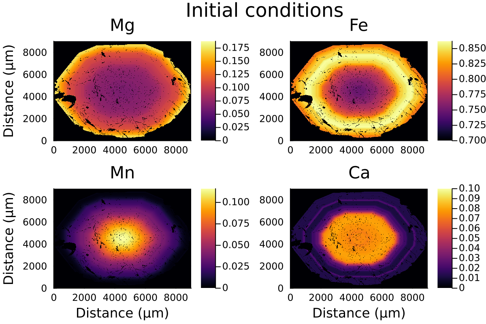

# [Diffusion in 2D Cartesian coordinates on CPU](@id 2D_diffusion_CPU)

From chemical maps (e.g. obtained by microprobe or SEM), we can acquire 2D composition of garnet. Assuming an initial composition, we can diffuse a garnet grain major element composition.

When dealing with 2D or 3D data, the question of performance comes into play. It is important to write performant code that scales well. To help us with this, DiffusionGarnet internally uses the package [ParallelStencil.jl](https://github.com/omlins/ParallelStencil.jl), which allows to write high-level code for parallel high-performance stencil computation on both GPUs and CPUs. We will focus on CPUs in this tutorial, as they are easier to set up, but significant performance gains can be expected on GPUs.

To get the most out of this approach, it is important to start Julia with multiple threads as multithreading is the approach used to parallelise the code. See the [official Julia documentation](https://docs.julialang.org/en/v1/manual/multi-threading/) for more information.

To achieve this, the simpler is to start Julia with:

```
$ julia --threads auto
```

which should select the maximum number of threads available on your machine.

The check that, we can use:

```julia-repl
julia> println("Number of threads: $(Base.Threads.nthreads())")
16
```

which outputs the current number of threads used in the Julia session (here 16).

!!! tip
    The degree of parallelisation that can be achieved increases with the number of threads available.

For this tutorial, we will use example data from the [2D examples section](https://github.com/Iddingsite/DiffusionGarnet.jl/tree/main/examples/2D), which contain four composition matrices, and the contour of the garnet grain.

First, we load the data, which should be in the same folder as your current session:

```julia
using DiffusionGarnet  # this can take a while
using DelimitedFiles
using Plots
using ProgressBars

println("Number of threads: $(Threads.nthreads())")

# load the data of your choice
# (here from the text files located in https://github.com/Iddingsite/DiffusionGarnet.jl/tree/main/examples/2D,
# place it in the same folder as where you are running the code)

Mg0 = DelimitedFiles.readdlm("Xprp.txt", '\t', '\n', header=false)
Fe0 = DelimitedFiles.readdlm("Xalm.txt", '\t', '\n', header=false)
Mn0 = DelimitedFiles.readdlm("Xsps.txt", '\t', '\n', header=false)
Ca0 = DelimitedFiles.readdlm("Xgrs.txt", '\t', '\n', header=false)
grt_boundary = DelimitedFiles.readdlm("contour_Grt.txt", '\t', '\n', header=false)

# define total length in x and y
Lx = 9000.0u"µm"
Ly = 9000.0u"µm"
# define total time for the model
tfinal = 1.0u"Myr"
# define the pressure and temperature conditions
T = 900u"°C"
P = 0.6u"GPa"
```

Plotting the initial data:

```julia
distance = LinRange(0, ustrip(u"µm", Lx), size(Mg0,1))

l = @layout [a b ; c d ]

p1 = heatmap(distance, distance, Mg0, label="Mg", dpi=200, title="Mg", clim=(0, maximum(Mg0)), ylabel= "Distance (µm)")
p2 = heatmap(distance, distance, Fe0, label="Fe", dpi=200, title="Fe", clim=(0.7, maximum(Fe0)))
p3 = heatmap(distance, distance, Mn0, label="Mn", dpi=200, title="Mn", clim=(0, maximum(Mn0)), xlabel= "Distance (µm)", ylabel= "Distance (µm)")
p4 = heatmap(distance, distance, Ca0, label="Ca", dpi=200, title="Ca", clim=(0, 0.1), xlabel= "Distance (µm)")

plot(p1, p2, p3, p4, layout = l , plot_title="Initial conditions")
```

which outputs:



Like with [spherical](@ref sph_diffusion) or [1D Cartesian](@ref 1D_diffusion) coordinates, we need to define our `InitialConditions` and `Domain` structures, that will hold all the information of our model.

```julia
IC2D = InitialConditions2D(Mg0, Fe0, Mn0, Lx, Ly, tfinal; grt_boundary = grt_boundary)
domain2D = Domain(IC2D, T, P)
```

!!! note
    The argument `grt_boundary` is a binary array specifiying the coordinates where the homogeneous Dirichlet boundaries are to be enforced, here on the contour of the grain. If not provided, the homogeneous Dirichlet boundaries are applied to the sides of the domain.

Using the function `simulate()` to solve our system:

```julia
# solve the problem using DifferentialEquations.jl
sol = simulate(Domain2D)
```

!!! note
    The calculation can take some time, about 6 minutes on my machine with 16 threads.

We can now plot the results:

```julia
@unpack tfinal_ad, t_charact = domain2D

println("Plotting...")
anim = @animate for i = tqdm(LinRange(0, tfinal_ad, 20))

    time = round(i*t_charact;digits=2)

    l = @layout [a b ; c d ]
    Ca = 1 .- sol(i)[:,:,1] .- sol(i)[:,:,2] .- sol(i)[:,:,3]
    replace!(Ca, 1=>0)

    p1 = heatmap(distance, distance, sol(i)[:,:,1], label="Mg", dpi=100, title="Mg", clim=(0, maximum(sol(0)[:,:,1])), ylabel= "Distance (µm)")
    p2 = heatmap(distance, distance, sol(i)[:,:,2], label="Fe", dpi=100, title="Fe", clim=(0.7, maximum(sol(0)[:,:,2])))
    p3 = heatmap(distance, distance, sol(i)[:,:,3], label="Mn", dpi=100, title="Mn", clim=(0, maximum(sol(0)[:,:,3])), xlabel= "Distance (µm)", ylabel= "Distance (µm)")
    p4 = heatmap(distance, distance, Ca, label="Ca", dpi=100, title="Ca", clim=(0, 0.1), xlabel= "Distance (µm)")

    plot(p1, p2, p3, p4, layout = l , plot_title="Total Time = $(time) Ma, T=$(round(ustrip.(u"°C", T); digits=2)) °C")
end every 1

println("...Done!")

println("Now, generating the gif...")
gif(anim, "Grt_2D_900.gif", fps = 3)
println("...Done!")

```

Here is the resulting gif:


!!! note
    2D modelling ignores the effect of the third dimension on diffusion and is equivalent to considering the garnet grain to be cylindrical rather than spherical.
