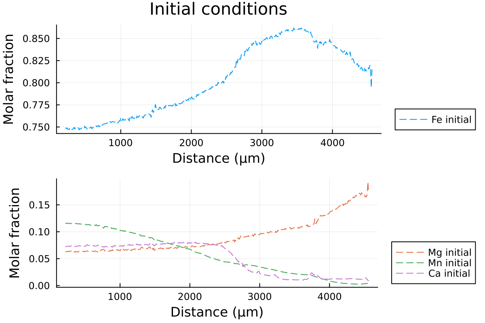

# Diffusion in spherical coordinates

When working with 1D profiles of major elements in garnet, it is often better to consider spherical coordinates. This approximates a garnet grain as a sphere and allows the change in volume relative to the distance from the core to be taken into account.

In DiffusionGarnet, spherical coordinates are as easy to use as 1D Cartesian coordinates. To illustrate this, we will compare the diffusion of a core-rim profile using the 2 coordinate systems. We will follow the same procedure as in the [1D diffusion tutorial](@ref 1D_diffusion).

First we will load the data of the core-rim profile from the [Spherical examples section](https://github.com/Iddingsite/DiffusionGarnet.jl/tree/main/examples/Spherical), which should be in the same folder as your current session:

```julia
using DiffusionGarnet
using DelimitedFiles

data = DelimitedFiles.readdlm("Data_Grt_Sph.txt", '\t', '\n', header=true)[1]

Mg0 = data[:, 4]
Fe0 = data[:, 2]
Mn0 = data[:, 3]
Ca0 = data[:, 5]
distance = data[:, 1]
Lx = Lr = (data[end,1] - data[1,1])u"µm"
tfinal = 15u"Myr"
```

We can visualize our data:

```julia
using Plots

l = @layout [a ; b]

p1 = plot(distance, Fe0, label="Fe initial", linestyle = :dash, linewidth=1, dpi=200, title = "Initial conditions", legend=:outerbottomright, linecolor=1,xlabel = "Distance (µm)", ylabel="Molar fraction")

p2 = plot(distance, Mg0, label="Mg initial", linestyle = :dash, linewidth=1, dpi=200,legend=:outerbottomright,linecolor=2,xlabel = "Distance (µm)")
p2 = plot!(distance, Mn0, label="Mn initial", linestyle = :dash, linewidth=1, linecolor=3)
p2 = plot!(distance, Ca0, label="Ca initial", linestyle = :dash, linewidth=1, linecolor=4, ylabel="Molar fraction")

plot(p1, p2, layout = l)
```

which output:



Then, we can define our initial conditions, both for the spherical and 1D Cartesian coordinates.

```julia
ICSph = InitialConditionsSpherical(Mg0, Fe0, Mn0, Lr, tfinal)
IC1D = InitialConditions1D(Mg0, Fe0, Mn0, Lx, tfinal)

# define the pressure and temperature conditions of diffusion
T = 900u"°C"
P = 0.6u"GPa"

DomainSph = Domain(ICSph, T, P)
Domain1D = Domain(IC1D, T, P; bc_neumann = (true, false))
```

!!! tip
    `InitialConditionsSpherical` always assumes that the core of the profile is on the left and the edge is on the right side.

!!! note
    We use `bc_neumann` in `Domain` to indicate that a homogeneous Neumann boundary must be ensured on the left side of the 1D profile to simulate the core of the garnet grain.

We can then use the function `simulate()` to solve our system:

```julia
# solve the problem using DifferentialEquations.jl
sol_sph = simulate(DomainSph)
sol_1D = simulate(Domain1D)
```

and compare the 2 solutions:

```julia
@unpack tfinal_ad, t_charact = DomainSph

anim = @animate for i = LinRange(0, tfinal_ad, 100)
    l = @layout [a ; b]

    p1 = plot(distance, Fe0, label="Fe initial", linestyle = :dash, linewidth=1, dpi=200, title = "Total Time = $(round(((i)* t_charact);digits=2)) Ma", legend=:outerbottomright, linecolor=1,xlabel = "Distance (µm)")
    p1 = plot!(distance, sol_sph(i)[:,2], label="Fe Sph",linecolor=1, linewidth=1)
    p1 = plot!(distance, sol_1D(i)[:,2], label="Fe 1D",linecolor=5, linewidth=1)


    p2 = plot(distance, Mg0, label="Mg initial", linestyle = :dash, linewidth=1, dpi=200,legend=:outerbottomright,linecolor=2,xlabel = "Distance (µm)")
    p2 = plot!(distance, Mn0, label="Mn initial", linestyle = :dash, linewidth=1, linecolor=3)
    p2 = plot!(distance, Ca0, label="Ca initial", linestyle = :dash, linewidth=1, linecolor=4)
    p2 = plot!(distance, sol_sph(i)[:,1], label="Mg Sph",linecolor=2, linewidth=1)
    p2 = plot!(distance, sol_1D(i)[:,1], label="Mg 1D",linecolor=6, linewidth=1)

    p2 = plot!(distance, sol_sph(i)[:,3], label="Mn Sph", linecolor=3, linewidth=1)
    p2 = plot!(distance, sol_1D(i)[:,3], label="Mn 1D", linecolor=7, linewidth=1)

    p2 = plot!(distance, 1 .- sol_sph(i)[:,1] .- sol_sph(i)[:,2] .- sol_sph(i)[:,3], label="Ca Sph", linecolor=4, linewidth=1)
    p2 = plot!(distance, 1 .- sol_sph(i)[:,1] .- sol_sph(i)[:,2] .- sol_sph(i)[:,3], label="Ca 1D", linecolor=8, linewidth=1)

    plot(p1, p2, layout = l)
end every 1

println("Now, generating the gif...")
gif(anim, "Grt_Spherical+1D.gif", fps = 7)
println("...Done!")
```

With the resulting gif:


It shows that using spherical coordinates makes the garnet diffuse faster. Using 1D Cartesian coordinates can overestimate the equilibration time.