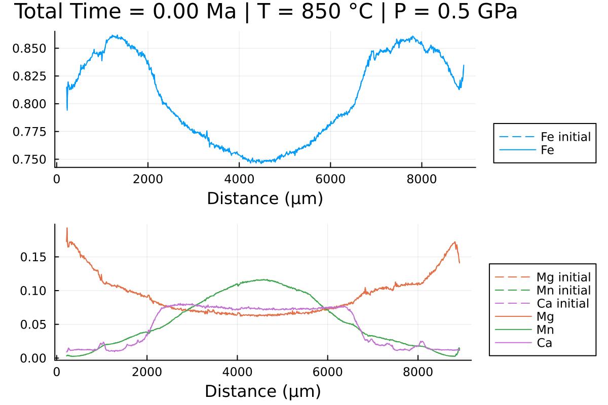

# [Updating pressure and temperature conditions](@id PT_callback)

When modelling diffusion in garnet, it may be relevant to update the pressure and temperature (PT) conditions during the simulation, i.e. to model a decompression event in the retrograde path.

To do this, we can use a callback function. A callback function is a function that can be called in our solver when a certain condition is met, i.e. when a certain time is reached. It is based on the [DiffEqCallbacks](https://docs.sciml.ai/DiffEqCallbacks/stable/) package from the [DifferentialEquations.jl](https://docs.sciml.ai/DiffEqDocs/stable/) ecosystem.

For this tutorial, we will use the same data from the tutorial in [1D Cartesian coordinates](@ref 1D_diffusion):

```julia
using DiffusionGarnet  # this can take a while
using DelimitedFiles
# load the data of your choice (here from the text file located in https://github.com/Iddingsite/DiffusionGarnet.jl/tree/main/examples/1D, place it in the same folder as where you are running the code)
data = DelimitedFiles.readdlm("Data_Grt_1D.txt", '\t', '\n', header=true)[1]

Mg0 = data[:, 4]  # load initial Mg mole fraction
Fe0 = data[:, 2]  # load initial Fe mole fraction
Mn0 = data[:, 3]  # load initial Mn mole fraction
Ca0 = data[:, 5]  # load initial Ca mole fraction
distance = data[:, 1]

Lx = (data[end,1] - data[1,1])u"µm"  # length in x of the model, here in µm
tfinal = 15u"Myr"  # total time of the model, here in Myr

# define the initial conditions in 1D of your problem in that order.
IC1D = InitialConditions1D(Mg0, Fe0, Mn0, Lx, tfinal)
```

We will now define the PT evolution of our model. To do this, we define 3 arrays containing the pressure, temperature and the time at which the conditions are updated:

```julia
T = [900, 850, 800, 750, 700, 650, 600, 550]u"°C"
P = [0.6, 0.5, 0.4, 0.3, 0.3, 0.3, 0.3, 0.3]u"GPa"
time_update = [0, 2, 4, 6, 8, 10, 12, 14]u"Myr"
```

!!! note
    All three arrays must have the same size and with units. Make sure to also define the conditions at time 0.

This can be supplied to `Domain`:

```julia
domain1D = Domain(IC1D, T, P, time_update)
```

Now that we have the time and PT conditions to update, we need to create our callback function. We will use the [`PresetTimeCallback()`](https://docs.sciml.ai/DiffEqCallbacks/stable/timed_callbacks/#DiffEqCallbacks.PresetTimeCallback) function which takes as input the times at which the callback is to be triggered and the function to be called at that time.

```julia
# extract time_update_ad from domain1D
@unpack time_update_ad = domain1D

# define our callback function
update_diffusion_coef_call = PresetTimeCallback(time_update_ad, update_diffusion_coef)
```

!!! note
    `time_update_ad` is the equivalent of `time_update` in nondimensional time. `update_diffusion_coef` is a function that updates the diffusion coefficients according to the new PT conditions.

We can now provide our callback function to `simulate` and run our model:

```julia
sol = simulate(domain1D; callback=update_diffusion_coef_call);
```

This outputs the time at which the callback function was called and the new PT conditions, and the total solver runtime:

```
New temperature and pressure: 850.0 °C and 5.0 kbar, updated at 2.0 Myr.
New temperature and pressure: 800.0 °C and 4.0 kbar, updated at 4.0 Myr.
New temperature and pressure: 750.0 °C and 3.0 kbar, updated at 6.0 Myr.
New temperature and pressure: 700.0 °C and 3.0 kbar, updated at 8.0 Myr.
New temperature and pressure: 650.0 °C and 3.0 kbar, updated at 10.0 Myr.
New temperature and pressure: 600.0 °C and 3.0 kbar, updated at 12.0 Myr.
New temperature and pressure: 550.0 °C and 3.0 kbar, updated at 14.0 Myr.
  0.752661 seconds (44.65 k allocations: 25.676 MiB)
```

We can now plot our results and see how the change in PT has affected our diffusion profiles:

```julia
@unpack tfinal_ad, t_charact = domain1D

anim = @animate for i = LinRange(0, tfinal_ad, 100)
    l = @layout [a ; b]

    p1 = plot(distance, Fe0, label="Fe initial", linestyle = :dash, linewidth=1, dpi=200, title = "Total Time = $(round(((i)* t_charact);digits=2)) Ma", legend=:outerbottomright, linecolor=1,xlabel = "Distance (µm)")
    p1 = plot!(distance, sol(i)[:,2], label="Fe",linecolor=1, linewidth=1)


    p2 = plot(distance, Mg0, label="Mg initial", linestyle = :dash, linewidth=1, dpi=200,legend=:outerbottomright,linecolor=2,xlabel = "Distance (µm)")
    p2 = plot!(distance, Mn0, label="Mn initial", linestyle = :dash, linewidth=1, linecolor=3)
    p2 = plot!(distance, Ca0, label="Ca initial", linestyle = :dash, linewidth=1, linecolor=4)
    p2 = plot!(distance, sol(i)[:,1], label="Mg",linecolor=2, linewidth=1)

    p2 = plot!(distance, sol(i)[:,3], label="Mn", linecolor=3, linewidth=1)

    p2 = plot!(distance, 1 .- sol(i)[:,1] .- sol(i)[:,2] .- sol(i)[:,3], label="Ca", linecolor=4, linewidth=1)

    plot(p1, p2, layout = l)
end every 1

println("Now, generating the gif...")
gif(anim, "Grt_1D_var_TP.gif", fps = 7)
println("...Done!")

```

which outputs:



We can clearly observe the slowing down of the diffusion processes as the PT conditions decrease with time.
